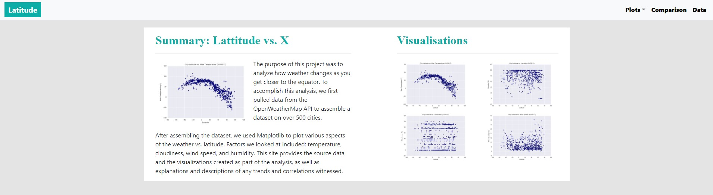
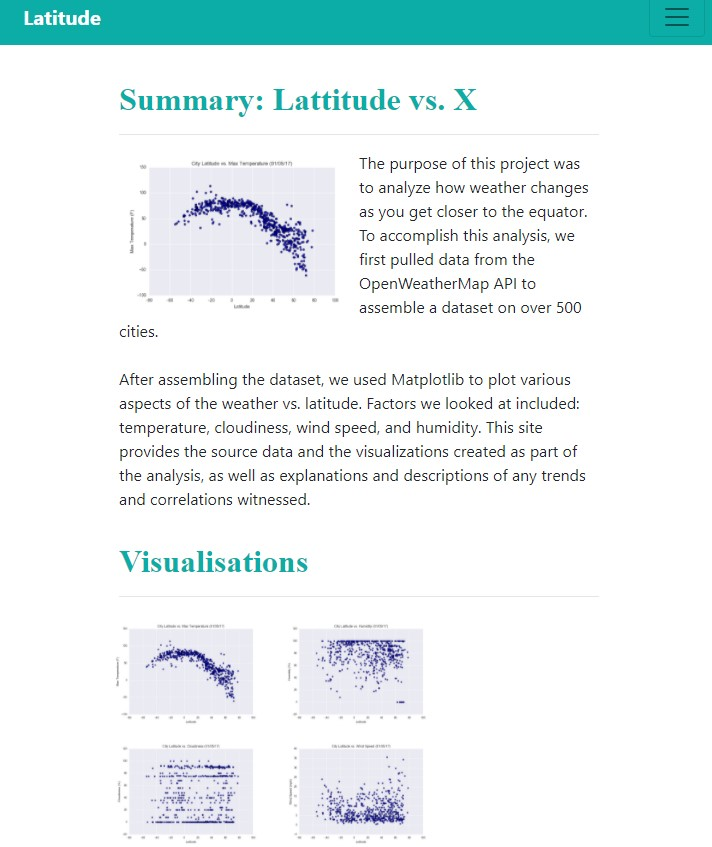

# Web Visualisaation Dashboard
A visualisation dashboard investigating how a city's latitude affects its weather, specifically, max temperature, humidity, cloudiness and wind speed.

Published at https://alvin1359.github.io/latitude-weather-analysis-web-dashboard/

## Repository Structure
```
project  
|__ assets/                              
|         |_ css/          # contains css styling sheet
|         |_ images/       # contains images of graphs
|
|__ images/                # contains images of final web page
|
|__ resources/             # contains data sets
|
|__ templates/             # contains html files for web pages
|
|__ index.html             # landing html page
|
|__ README.md              # readme file

```

## Website Requirements
- The website must consist of 7 pages total, including:
   - A landing page containing:
      - An explanation of the project.
      - Links to each visualizations page. There should be a sidebar containing preview images of each plot, and clicking an image should take the user to that visualization.  


   - Four visualization pages, each with:  
      - A descriptive title and heading tag.
      - he plot/visualization itself for the selected comparison.
      - A paragraph describing the plot and its significance.


   - A "Comparisons" page that:
      - Contains all of the visualizations on the same page so we can easily visually compare them.
      - Uses a Bootstrap grid for the visualizations.
      - The grid must be two visualizations across on screens medium and larger, and 1 across on extra-small and small screens.

   - A "Data" page that:
      - Displays a responsive table containing the data used in the visualizations.
      - The table must be a bootstrap table component.

- The website must, at the top of every page, have a navigation menu that:

   - Has the name of the site on the left of the nav which allows users to return to the landing page from any page.
   - Contains a dropdown menu on the right of the navbar named "Plots" that provides a link to each individual visualization page.
   - Provides two more text links on the right: "Comparisons," which links to the comparisons page, and "Data," which links to the data page.
   - Is responsive (using media queries). The nav must have similar behavior as the screenshots "Navigation Menu" section

## Landing Page
### Large Screen


### Small Screen

